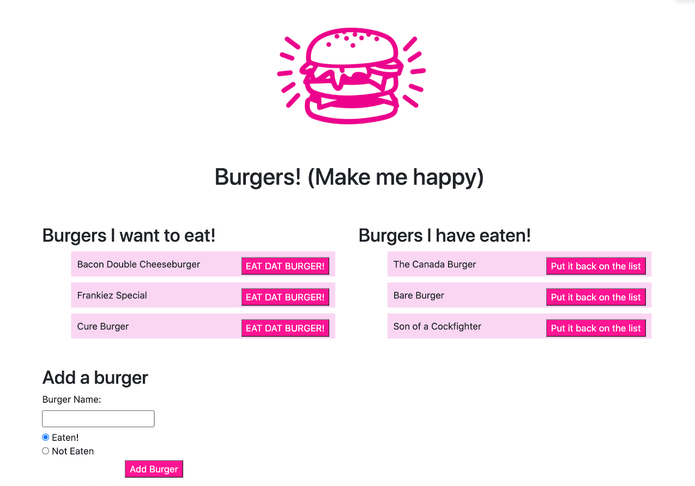

# EatDatBurger

## Description
EatDatBurger is a tool for keeping track of the burgers a user wants to eat, and the burgers they have already eaten.  Data on the burgers is stored on a SQL database, then viewed and manipulated through the website.

## Motivation
Everyone loves a good burger, right?  And now there are more places than every to get your gormet burger fix.  There is fierce competition for the best burger in your city, and with so many to try, how are people supposed to keep up?  EatDatBurger gives users a personal record of the burgers they have tried, and the ones they need to try next.

## Screenshots

## Build status
Minimum Viable Product.  Ready for use, but requiring further testing and feedback.

## Key technologies used
Javascript
SQL
Handlebars
Node

## Code Example
var express = require("express");
var PORT = process.env.PORT || 8080;
var app = express();

app.use(express.static("public"));

app.use(express.urlencoded({ extended: true }));
app.use(express.json());

var exphbs = require("express-handlebars");

app.engine("handlebars", exphbs({ defaultLayout: "main" }));
app.set("view engine", "handlebars");

var routes = require("./controllers/burgerController.js");

app.use(routes);

## Installation
Requires NPM, otherwise working on Heroku

## Contribute
Git pull
